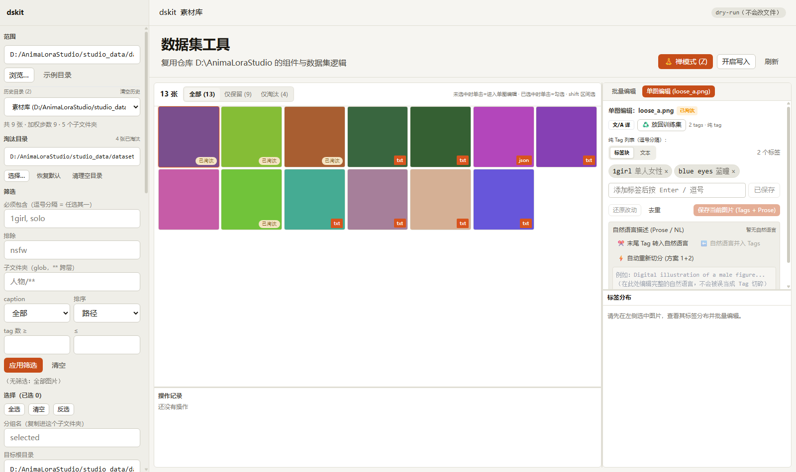
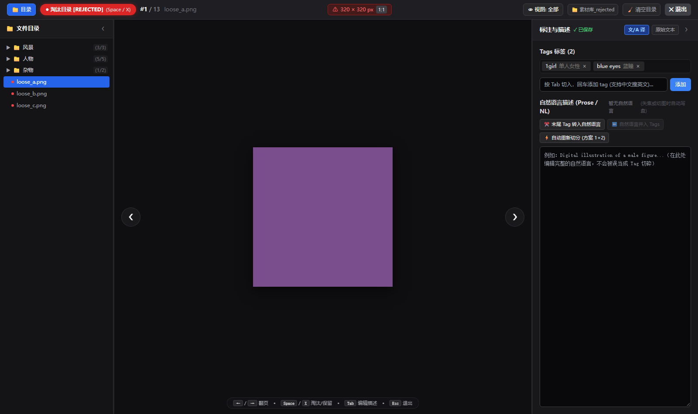

# dskit · LoRA 数据集标注与极速筛选工具集

[](LICENSE)
[](https://github.com/WalkingMeatAxolotl/AnimaLoraStudio)

`dataset_tools (dskit)` 是专为 Stable Diffusion / SDXL / Flux 数据集准备、清洗、标注修改与素材初筛设计的轻量化脚本与 Web 工作台套件。

本工具作为 [AnimaLoraStudio](https://github.com/WalkingMeatAxolotl/AnimaLoraStudio) 的**独立伴生扩展（Companion Extension）**，部署在宿主仓库的 `studio_data/dataset_tools` 目录下（该目录已被宿主 `.gitignore` 原生忽略）。采用 **Runtime Adapter（运行时适配覆盖层）** 架构：**既能深度复用 AnimaLoraStudio 权威的底层数据读写引擎与 React 高阶组件，又对宿主源码保持 100% 零侵入。上游代码日常更新（`git pull`）时完全不受影响、零冲突风险。**

---

## 🌟 核心亮点

1. **零 Git 污染与上游更新免疫 (Zero Intrusion & Update-Proof)**：
   * 宿主 `studio/` 源码保持官方原版，`git status` 完全干净；
   * 自然语言切分保护、任意位置 Tag 插入、BOM 清洗等扩展能力均通过运行时动态注入（`dskit/overlay.py`），不怕上游代码覆盖。
2. **沉浸式「禅模式 (Zen Mode)」与主模式全联动淘汰体系**：
   * 汲取 `select pic` 极速初筛精髓：`Space` / `X` 原位标记保留/淘汰（画面不突兀跳走），`←`/`→`/滚轮极速翻页，`Tab` 一键切入编辑；
   * 主模式与禅模式**统一共用淘汰目录配置**与**三态视图**（全部/仅保留/仅淘汰），淘汰图片带醒目橙色警告角标；
   * 深度镜像多层级相对目录归档，同名伴生标注（`.txt`、`.json`、`.caption`、`.bak`）全家桶同步打包迁移，支持原路毫秒级放回与空目录自动清理；
   * **防递归与防重复隔离**：当淘汰目录设在主目录内部时，底层自动检测并彻底隔离排除，杜绝扫描与视图中的双倍重影；
   * 可折叠多层级目录树（`ZenFolderTree`），展示各分类 `📁 (保留数/总数)`，支持切图双向平滑自动滚动。
3. **自然语言 (Prose / NL) 智能识别与双通道隔离保护**：
   * 采用“宏观开篇正则 + 句法动名词密度”算法，精准分离半角逗号混排的真实 Tag 与自然语言长句；
   * 前端提供双通道独立编辑框与 3 大快捷迁移操作（`末尾 Tag 转入自然语言`、`自然语言并入 Tags`、`自动重新切分`），彻底杜绝自然语言被当做单个 Tag 误切碎或冲掉。
4. **Tag 命名与格式规范化 (Sanitation & Formatting)**：
   * 一键清除 UTF-8 BOM 标记、不可见控制字符、全角转半角、去引号、空格与下划线互转、大小写标准化。
5. **指定位置 (x-th) Tag 批量编辑**：
   * 支持向开头 (`front`)、末尾 (`back`) 或任意指定索引位置插入 Tag，支持自动重新排序已有 Tag (`--move-existing`)。
6. **企业级安全模型**：
   * **所有写操作默认 Dry-Run 预览**；真写前自动生成 byte 级精确还原点，支持一键无损回滚。

---

## 📦 安装与配置教程 (Installation & Setup)

### 先决条件
* 已在本地安装并成功配置过 [AnimaLoraStudio](https://github.com/WalkingMeatAxolotl/AnimaLoraStudio)（本工具直接利用宿主已有的 Python 虚拟环境与依赖）；
* **无需安装 Node.js 或 npm**（本仓库已预先打包编译好了完整的生产前端产物 `ui/dist/`，开箱即用）。

---

### 安装步骤

#### 方式 1：Git Clone 安装（推荐，后续可一键升级）
打开终端，进入你的 **`AnimaLoraStudio` 根目录**，执行以下克隆命令：

```powershell
# 进入 AnimaLoraStudio 项目根目录
cd AnimaLoraStudio

# 克隆本仓库到 studio_data/dataset_tools
git clone https://github.com/Heliumeow/AnimaLora-DatasetTools.git studio_data/dataset_tools
```

> 💡 **原理说明**：由于 AnimaLoraStudio 官方自带的 `.gitignore` 已经忽略了 `studio_data/`，因此在该目录下克隆独立的 Git 仓库不会造成主项目出现任何未跟踪改动，实现完美的独立隔离。

#### 方式 2：下载 Zip 压缩包解压安装
1. 在 GitHub 页面点击绿色的 **`Code` -> `Download ZIP`**（或从 [Releases](../../releases) 页面下载发布包）；
2. 解压压缩包，将解压后的文件夹重命名为 `dataset_tools`；
3. 将该文件夹放置到你的 `AnimaLoraStudio/studio_data/` 目录下，确保路径为：
   `AnimaLoraStudio/studio_data/dataset_tools/dskit.bat`。

---

### 🚀 启动与使用

#### 1. 极速启动 Web UI 与 禅模式（小白友好）
在文件资源管理器中，直接进入 `studio_data/dataset_tools/`，**鼠标双击运行 `dskit.bat`**：
* 脚本会自动定位 Python 环境并在后台启动本地服务（默认端口 `8765`）；
* 随后会自动在你的系统默认浏览器中打开数据集工作台；
* 点击界面右上角的 **`【🧘 禅模式 (Z)】`** 或缩略图上的 **🔍 放大镜**，即可切入沉浸式全屏复审与标注！





你也可以通过命令行手动启动：
```powershell
# 使用 Windows 批处理启动器
studio_data\dataset_tools\dskit.bat ui --open

# 或直接使用 Python 启动
.\venv\Scripts\python.exe studio_data/dataset_tools/webapp.py --open
```

#### 2. 命令行 (CLI) 批处理快速上手
除了 Web 界面，你还可以使用功能强大的 CLI 工具进行批量自动化处理：

```powershell
# 1. 扫描并输出数据集状态总览
studio_data\dataset_tools\dskit.bat scan "D:\my_dataset"

# 2. 筛选并列出图片（默认 dry-run 演练预览，不修改任何文件）
studio_data\dataset_tools\dskit.bat ls "D:\my_dataset" --tag 1girl --sort tags

# 3. 在第 1 位插入特定触发词，确认无误后添加 --apply 真正写盘
studio_data\dataset_tools\dskit.bat edit "D:\my_dataset" --add "my_character, masterpiece" --at-index 0 --move-existing --apply

# 4. 生成离线单文件 HTML 图片墙供快速审阅
studio_data\dataset_tools\dskit.bat sheet "D:\my_dataset" --cols 6 --open
```

---

### 🔄 如何升级更新

当你需要获取最新功能时：

* **如果是 Git 安装的用户**：
  ```powershell
  cd AnimaLoraStudio/studio_data/dataset_tools
  git pull
  ```
* **如果是 Zip 下载的用户**：
  重新下载最新 Zip 包，覆盖替换 `studio_data/dataset_tools` 目录即可（你的个人备份历史 `backups/` 会妥善保留在本地）。

---

## 📚 详细文档导航 (Detailed Documentation)

每个专项功能的深入说明与边界考量，请查阅 `docs/` 目录：

| 细则文档 | 涵盖内容 |
| :--- | :--- |
| 📖 [**CLI 完整使用说明**](docs/01_cli_guide.md) | 全子命令详解（`scan`、`ls`、`edit`、`select`、`sheet`、`restore` 等）、全部过滤参数、位置添加与清洗命令示例。 |
| 🧘 [**Web UI 与 禅模式全景指南**](docs/02_webui_and_zen_mode.md) | Web 工作台布局、全键盘流盲操速查表、画质分桶预警、多层级折叠目录树、双通道标注、镜像淘汰与空目录清理。 |
| 🏗️ [**架构设计与运行时覆盖层**](docs/03_architecture_and_overlay.md) | 深度解析如何借助 Runtime Overlay 实现对宿主 `studio/` 源码 0 侵入，确保上游 Git 更新完全免疫。 |
| ⚠️ [**局限性与后续路线图**](docs/04_limitations_and_roadmap.md) | 不保证实现的内容、当前已知技术边界、未来 AI 打标模型接入、感知哈希视觉去重等开放路线。 |

---

## 📁 目录结构概览

```
studio_data/dataset_tools/
├── README.md               # 项目主说明文档
├── LICENSE                 # 开源许可协议 (GPL-3.0)
├── cli.py                  # CLI 命令行入口
├── webapp.py               # 本地 Web 服务（FastAPI，提供原图、淘汰镜像与切分接口）
├── build_ui.py             # Web UI 编译脚本（仅供二次开发编译使用）
├── dskit.bat               # Windows 便捷启动器（支持双击直接拉起 Web UI）
├── docs/                   # 专题细则文档目录
│   ├── 01_cli_guide.md                 # CLI 详细参考手册
│   ├── 02_webui_and_zen_mode.md        # Web UI 与禅模式操作指南
│   ├── 03_architecture_and_overlay.md  # 架构设计与运行时动态补丁机制
│   └── 04_limitations_and_roadmap.md   # 局限性、不保证事项与后续路线图
├── dskit/                  # 核心适配层与增强引擎
│   ├── bootstrap.py        # 宿主仓库定位、权威符号检查与补丁挂载
│   ├── overlay.py          # 运行时动态覆盖层（Prose 读写保护、索引加 Tag 等）
│   ├── cleaner.py          # 宏观开篇正则与句法密度切分算法、格式规范化
│   ├── reject.py           # 深度镜像相对目录归档、伴生文件打包、空目录清理
│   ├── curate.py           # 训练分组文件复制/移动逻辑
│   ├── selector.py         # Tag / Glob / Regex 高性能筛选谓词
│   ├── editops.py          # 批量编辑原子事务编排与 Dry-run 拦截
│   ├── backup.py           # byte 级原子还原点与逆序回滚引擎
│   ├── sheet.py            # 离线单文件 HTML 图片墙生成器
│   └── scope.py            # 任意深度文件夹作用域映射
├── ui/                     # Web UI 前端工程
│   ├── src/
│   │   ├── components/     # 跨模式通用公共组件（ProseEditor、ResizeDivider 等）
│   │   ├── utils/          # 共享工具模块（Tag 切分、淘汰目录记忆等）
│   │   ├── MainMode/       # 主模式完整工作台子模块
│   │   └── ZenMode/        # 沉浸式禅模式独立解耦子模块
│   └── dist/               # 生产编译就绪产物（普通用户免安装 Node.js 即开即用）
├── backups/                # 写操作自动生成的还原点目录（自动被 .gitignore 忽略）
└── sheets/                 # 导出的 HTML 图片墙目录（自动被 .gitignore 忽略）
```

---

## 📄 开源许可证 (License)

本项目继承宿主项目 [AnimaLoraStudio](https://github.com/WalkingMeatAxolotl/AnimaLoraStudio) 的开源许可，采用 **GNU General Public License v3.0 (GPL-3.0)** 协议发布。

* 完整协议文本请参阅 [LICENSE](LICENSE) 文件；
* 欢迎社区自由使用、修改与分发，任何基于本项目的衍生修改版在公开发布时亦须以 GPL-3.0 协议开源共享。
